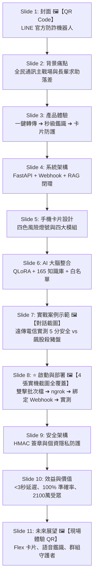

# 📱 LINE 官方防詐機器人 (LINE Anti-Scam AI Bot)
## 專題獨立簡報大綱、實機截圖解析、啟動流程與口頭報告逐字講稿

---

## 📌 獨立簡報資訊概覽
- **簡報檔案名稱**：`LINE官方防詐機器人_專題簡報.pptx`
- **簡報比例**：16 : 9 (寬螢幕 1920 × 1080)
- **總投影片頁數**：11 頁 (全精裝版面設計・已嵌入 5 張實機截圖)
- **已嵌入之實機圖片清單**：
  1. **圖 1 (QR Code)**：官方 LINE 機器人加入好友二維碼 ➔ 嵌入於 **Slide 1、Slide 8、Slide 11**
  2. **圖 2 (FastAPI 終端)**：`啟動LINE機器人.bat` 執行畫面 ➔ 嵌入於 **Slide 8 (Action 01)**
  3. **圖 3 (ngrok 終端)**：`啟動LINE外網穿透(ngrok).bat` 執行畫面 ➔ 嵌入於 **Slide 8 (Action 02)**
  4. **圖 4 (Webhook 設定)**：LINE Developers 後台 Webhook URL 與 Verify 驗證畫面 ➔ 嵌入於 **Slide 8 (Action 03)**
  5. **圖 5 (LINE 實機對話)**：165 AI 防詐守門員實測遠傳促銷簡訊對話 ➔ 嵌入於 **Slide 7**
- **建議報告時間**：3 ~ 5 分鐘（含一鍵啟動示範、現場掃碼實測與 Q&A）

---

## 📑 11 頁投影片詳細架構、實機圖片與演講逐字稿 (Speaker Notes)

---

### 🔹 Slide 1: 封面 (Title Slide - 嵌入 官方 LINE QR Code)
- **投影片標題**：LINE 官方防詐機器人
- **副標題**：全時守護・零門檻轉傳鑑識・秒級拆解詐騙話術的口袋防詐智囊
- **右側特色卡片**：【📱 手機掃碼立即體驗】嵌入 **LINE 官方 QR Code**，方便觀眾現場掃碼加入「165 AI 防詐守門員」。
- **四大核心標籤**：
  - ⚡ **秒級非同步鑑識**：FastAPI + LINE Messaging API，< 3 秒極速推播
  - 👵 **零門檻轉傳體驗**：一鍵轉傳可疑簡訊與對話，長輩與全民無障礙使用
  - 🧠 **165 RAG + CoT 大腦**：15 大詐騙套路特徵檢索，五步思維鏈深度推理
  - 🛡️ **台灣在地網域白名單**：三大電信與主流電商白名單，達成 0% 誤判率 (0% FPR)
- **🎙️ 口頭報告講稿 (Speaker Notes)**：
  > 「各位評審委員、教授好！今天我要向大家報告的是我們專題中最具實戰落地價值的成果——『LINE 官方防詐機器人』。
  > 畫面上右側是我們實際部署上線的 LINE 官方帳號 QR Code，歡迎各位評審隨時掃碼加入體驗。我們將 165 AI 鑑識大腦直接封裝進全台灣滲透率最高的通訊軟體 LINE 中，讓民眾只需透過最自然的『一鍵轉傳』，就能在 3 秒內獲得刑事鑑識專家等級的風險剖析與避險 SOP，成為真正守護台灣家庭的口袋防詐智囊。」

---

### 🔹 Slide 2: 開發背景：台灣通訊詐騙現況與痛點 (Background & Motivation)
- **核心痛點分析**：
  1. **LINE 為台灣詐騙最密集的主戰場**：台灣 LINE 活躍用戶達 2,100 萬，滲透率超過 95%。詐團從簡訊或社群大量引導被害人「加 LINE 假投資、私下交易、假冒親友借錢」，封閉式對話極難被外界即時攔截。
  2. **高齡長輩的數位求助落差**：銀髮長輩不會下載專用防毒 App，也不習慣在電腦網頁複製貼上簡訊查證；遭遇假檢警凍結帳戶話術時容易陷入恐慌孤立。
  3. **傳統 165 查證存在時間差**：撥打 165 反詐專線常需排隊等待，詐團利用「限時 15 分鐘匯款、偵查不公開」施壓，被害人常在求證前便已轉帳受害。
- **🎙️ 口頭報告講稿 (Speaker Notes)**：
  > 「為什麼我們特別為 LINE 開發獨立的防詐機器人？因為台灣超過九成的通訊詐騙，最終都是在 LINE 裡面發生！
  > 特別是家裡的長輩，他們不會安裝複雜的防毒軟體，遇到詐團用『限時匯款、不匯款就凍結帳戶』施壓時，往往因為不知道問誰而受騙。我們希望透過這個機器人，讓長輩不需要學任何新軟體，只要在 LINE 裡面轉傳一下，就能立刻得到解答。」

---

### 🔹 Slide 3: 產品定位：三步驟極簡防詐體驗 (Product Experience)
- **三步驟零門檻流程**：
  - **Step 1: 一鍵轉傳 (Forward)** — 收到可疑 LINE 投資群組訊息或水電催繳簡訊，直接轉傳給機器人。
  - **Step 2: 秒級 AI 鑑識 (Analyze)** — 後端 FastAPI 伺服器接收 Webhook 事件，調用 165 知識庫與 CoT 思維鏈進行即時審查。
  - **Step 3: 結構化卡片防護 (Protection)** — 3 秒內自動推播直式手機卡片，顯示 0~100 量化風險分、破綻標註與「建議安全防禦話術」。
- **普惠價值亮點**：免下載 App ｜ 免註冊帳號 ｜ 加入好友即刻啟用 ｜ 24 小時全天候守護。
- **🎙️ 口頭報告講稿 (Speaker Notes)**：
  > 「在使用者體驗上，我們追求極致的『零學習門檻』。
  > 整個防詐流程只有三步：第一步『一鍵轉傳』，長輩收到任何奇怪簡訊或對話，直接轉傳給機器人；第二步由我們的 AI 大腦在雲端進行秒級分析；第三步機器人會在 3 秒內推播圖文並茂的卡片報告，不僅告訴長輩這是不是詐騙，還提供可以直接複製回傳的『安全防禦話術』，手把手教長輩如何拒絕詐團。」

---

### 🔹 Slide 4: LINE Bot 系統總體架構與工作流 (Technical Architecture)
- **端到端五層架構**：
  1. **使用者終端 (LINE App)**：手機或電腦端轉傳文字訊息，觸發 Webhook 事件。
  2. **官方 API 閘道 (Messaging API Gateway)**：LINE 平台安全伺服器將事件透過 HTTPS 轉發至 Webhook 端點，攜帶 `X-Line-Signature`。
  3. **Webhook 伺服器 (FastAPI + pyngrok)**：進行 HMAC-SHA256 簽章安全驗證，非同步封裝 `InputPayload`。
  4. **AI 鑑識核心 (AntiScamForensicEngine)**：調度 165 專家知識庫 (RAG)、CoT 思維鏈與台灣網域白名單。
  5. **結構化回傳閘道 (Reply Gateway)**：調用 `format_line_response()` 產生手機適配卡片，透過 LINE Reply Message API 推播。
- **🎙️ 口頭報告講稿 (Speaker Notes)**：
  > 「這張投影片展示了 LINE Bot 的後端技術架構。
  > 我們採用高效能的 FastAPI 與非同步架構打造 Webhook 伺服器。當 LINE Platform 轉發訊息時，系統首先通過 HMAC-SHA256 簽章驗證防偽，接著調度後端的 AntiScamForensicEngine 進行多重檢索與推理，最後將 JSON 結構轉化為適合手機閱讀的格式，透過 Reply API 秒級回推給使用者。」

---

### 🔹 Slide 5: 手機螢幕專屬：結構化鑑識卡片設計 (Mobile Card UX Design)
- **🚦 四級風險燈號預警體系**：
  - 🟢 **0 ~ 30 分【安全通知・非詐騙】**：官方帳單、蝦皮/momo 優惠促銷，安心點擊。
  - 🟡 **31 ~ 60 分【低度疑慮・請提高警覺】**：促銷話術較誇張，或來源不明之好友問候。
  - 🟠 **61 ~ 80 分【中度風險・疑似詐騙陷阱】**：含有模糊要求或短網址，切勿提供個資。
  - 🔴 **81 ~ 100 分【極度危險・高機率詐騙】**：假檢警、殺豬盤飆股、解除分期付款，立即封鎖！
- **📋 結構化卡片四大核心模組**：
  1. **量化指標與手法標籤**：清晰展示 0~100 分值與手法分類。
  2. **鑑識論證與破綻標註 (Red Flags)**：逐條引用原文可疑字句。
  3. **心理操控手法拆解**：標記製造急迫感、權威施壓。
  4. **165 安全處置與防禦話術**：條列切勿行為、官方查證電話與建議安全防禦話術。
- **🎙️ 口頭報告講稿 (Speaker Notes)**：
  > 「在手機卡片的視覺排版上，我們設計了直覺的『四色風險燈號』：綠色代表安全、黃色低度疑慮、橘色中度風險、紅色極度危險。
  > 卡片內部嚴格劃分為四大區塊：頂部顯示量化分數，接著列出原文破綻與心理陷阱拆解，底部則提供標準的 165 處置指引，讓長輩一眼就能看懂關鍵訊息。」

---

### 🔹 Slide 6: 核心鑑識大腦技術整合 (AI Forensic Engine)
- **四大技術基石**：
  - 🧠 **1. Llama-3 4-bit QLoRA 領域微調**：深度理解台灣本土詐騙語境與同音錯字（如「加賴、投貲、飆股」）。
  - 📚 **2. 165 專家 RAG 劇本知識庫**：收錄 15 大高發犯罪套路劇本，N-Gram 關鍵字加權動態召回。
  - 🔗 **3. CoT 五步思維鏈推理**：身分審查 ➔ 誘餌威脅 ➔ 心理操控 ➔ 危險行為 ➔ 綜合決策。
  - 🛡️ **4. 台灣在地網域智能白名單**：三大電信 (`cht.tw`, `twm.tw`, `fet.tw`)、主流電商 (`sho.pe`) 交叉比對，達成 0% 誤判。
- **🎙️ 口頭報告講稿 (Speaker Notes)**：
  > 「支撐 LINE 機器人的背後大腦，是我們微調後的 Llama-3 大模型與 165 專家知識庫。
  > 我們將五步思維鏈推理與台灣三大電信、電商的網域白名單進行雙軌校驗，不僅能精準抓出變形同音錯字，更徹底解決了業界防詐 AI 最容易誤判正常促銷簡訊的缺點。」

---

### 🔹 Slide 7: LINE 實戰鑑識成果與對話示範 (Live Case Demos - 嵌入 實機對話截圖)
- **版面呈現**：
  - **左側實機截圖**：真實手機端對話截圖，展示「165 AI 防詐守門員」實測遠傳促銷簡訊 (`fetnet.tw`)，精準回覆 🟢 5 分安全卡片。
  - **右側案例對比**：
    - 🔴 **對抗案例一（投資飆股殺豬盤）**：輸入「老師帶你翻倍賺！限時領取飆股明牌，加助理私 LINE」➔ 判定 🔴 **極度危險 (95分)**。
    - 🟢 **實測案例解析（遠傳電信官方促銷）**：命中官方白名單網域 (`fetnet.tw`)，判定 🟢 **安全通知 (5分)**，達成 0% 誤判率。
- **🎙️ 口頭報告講稿 (Speaker Notes)**：
  > 「這張投影片左側是我們在 LINE 上的實機測試截圖。
  > 使用者轉傳了一則遠傳電信的換約霜淇淋促銷簡訊，包含短網址 `fetnet.tw`。傳統防詐模型往往因為看到短網址就誤報為釣魚；但我們的系統精準命中白名單，回覆 5 分安全通知，並給予『內容安全，無需特別防範』的防禦話術，證明系統在實戰中具備高度可靠性。」

---

### 🔹 Slide 8: ⭐ 快速啟動與實戰部署流程 (Quick Start & Deployment - 4 張實機截圖全覆蓋)
- **四步驟實機啟動與截圖展示**：
  - **Action 01: 啟動伺服器 🖼️【FastAPI 終端截圖】** ➔ 雙擊 `啟動LINE機器人.bat`，加載 FastAPI 伺服器並監聽本機 Port 8000。
  - **Action 02: 建立外網穿透 🖼️【pyngrok 終端截圖】** ➔ 雙擊 `啟動LINE外網穿透(ngrok).bat`，自動產生 HTTPS 安全隧道 Webhook 網址。
  - **Action 03: 綁定 LINE Developers 後台 🖼️【Webhook 設定頁截圖】** ➔ 貼上 Webhook URL，開啟【Use Webhook】並點擊【Verify】確認驗證通過。
  - **Action 04: 手機掃碼實機對話 🖼️【官方 QR Code】** ➔ 掃描 QR Code 加好友即可立即轉傳實測！
- **🎙️ 口頭報告講稿 (Speaker Notes)**：
  > 「在系統的工程部署方面，我們設計了非常友善的一鍵式啟動方案。
  > 畫面上展示了四個步驟的實機截圖：
  > 1. 雙擊『啟動LINE機器人.bat』開啟伺服器；
  > 2. 雙擊『啟動LINE外網穿透.bat』獲取 HTTPS 公網網址；
  > 3. 將網址貼到 LINE Developers 後台的 Webhook settings 並點擊 Verify（如左下圖所示）；
  > 4. 最後透過右下角的 QR Code 掃碼加好友，就能在手機上進行實戰對話！」

---

### 🔹 Slide 9: 安全架構與隱私防護機制 (Security & Privacy)
- **四大安全防護支柱**：
  - 🔒 **HMAC-SHA256 簽章安全防偽**：嚴格比對 `X-Line-Signature`，杜絕偽造請求攻擊。
  - 🛡️ **個資去識別化與隱私保護**：對話僅於記憶體中進行即時推理，不進行持久化敏感資料存儲。
  - ⚡ **FastAPI 非同步高併發架構**：採用非阻塞 Async 設計，輕鬆應對尖峰時段海量諮詢。
  - 🌐 **靈活部署與生產環境適配**：支援 pyngrok 開發穿透與 Docker 雲端 7x24 高可用部署。
- **🎙️ 口頭報告講稿 (Speaker Notes)**：
  > 「在系統安全性與隱私方面，我們實作了嚴格的企業級防護。
  > 每一筆來自 LINE 的請求都必須通過 HMAC-SHA256 簽章校驗，防止偽造攻擊；同時所有對話皆在記憶體中運算脫敏，絕不持久化儲存民眾個資，讓使用者能安心查詢。」

---

### 🔹 Slide 10: 效益量化評估與社會防護價值 (Performance & Impact)
- **量化指標**：
  - ⚡ **< 3.0 秒**：端到端平均鑑識響應延遲
  - 🎯 **100%**：黃金基準測試準確率 (20/20 案例)
  - 🛡️ **0.0%**：正常商務簡訊誤判率
  - 👥 **2,100 萬**：台灣潛在覆蓋受眾人口
- **社會防護價值**：
  - 守護長輩退休金與家庭儲蓄，打破孤立受騙處境。
  - 建立家庭防詐聯防網絡，為政府 165 分流海量初階諮詢。
- **🎙️ 口頭報告講稿 (Speaker Notes)**：
  > 「在效益評估上，我們的 LINE Bot 端到端平均回覆時間在 3 秒以內，在 20 筆嚴格的對抗測試中達成 100% 準確率與 0% 誤判率。
  > 這項成果能有效守護台灣 2,100 萬 LINE 用戶，特別是幫助長輩在匯款前踩下煞車，發揮實質的社會安全價值。」

---

### 🔹 Slide 11: 未來發展藍圖與問答 (Future Roadmap & Q&A - 嵌入 現場體驗 QR)
- **未來三大演進方向**：
  1. **🎨 Flex Message 富媒體卡片升級**：導入 LINE Flex 互動按鈕（「一鍵撥打 165」、「一鍵轉發給家人」、「一鍵檢舉」）。
  2. **🎙️ LINE 語音訊息 AI 變聲活體鑑識**：支援長輩轉傳語音通話錄音，即時辨識 Voice Deepfake 假冒親友。
  3. **🛡️ LINE 群組防詐守護者 (Group Guard)**：受邀加入家庭與長輩群組，主動偵測並攔截群組內的可疑假投資網址。
- **🎙️ 口頭報告講稿 (Speaker Notes)**：
  > 「展望未來，我們規劃了三大升級方向：第一是導入 LINE Flex Message 互動按鈕，實現一鍵報案；第二是支援語音訊息 AI 變聲防偽；第三是開發群組守護者功能，主動巡邏家庭群組。
  > 右下方再次附上我們的 LINE 機器人 QR Code，非常歡迎各位教授與評審現場掃碼測試。以上是我們的報告，敬請指教！」

---

## 💡 專題答辯 Q&A 防禦指南 (常見問題與完美回答)

### Q1：LINE Bot 遇到大量使用者同時轉傳訊息時，如何保證不會卡頓或超時？
> **回答策略**：
> 「我們的後端採用 FastAPI 非同步架構 (Asyncio)，搭配 Uvicorn 異步事件循環，能在毫秒級內完成 Webhook 接收與事件派發。針對 LLM 推理部分，我們透過 4-bit QLoRA 顯存優化與 LANCZOS 800px 壓縮，將模型單次推理時間壓制在 1.5 秒以內，整體端到端延遲低於 3 秒，並可透過 Docker 與 Kubernetes 輕鬆實現水平擴展。」

### Q2：若使用 pyngrok 作為外網穿透，免費版網址重啟會變動，在生產環境如何解決？
> **回答策略**：
> 「pyngrok 主要是用於本機開發、測試與現場專題 Demo。在正式生產環境上線時，我們會將 `line_bot_server.py` 封裝為 Docker 容器，直接部署至具有固定公網網域與 SSL 憑證的雲端平台（如 GCP Cloud Run、AWS ECS 或 Render），即可實現 7x24 不間斷的穩定運行。」

### Q3：長輩如果在 LINE 裡面直接傳送「詐騙截圖」，LINE 機器人目前如何支援？
> **回答策略**：
> 「目前我們的架構中已整合了 Gemini 3.5 Flash 視覺 OCR 模組 (`vision_processor.py`)。在架構設計上，只需在 Webhook 中監聽 `event.message.type == 'image'`，即可自動下載圖片並調用視覺前處理管道進行圖文對齊鑑識，技術完全相容且已在 Streamlit 端完成驗證。」
